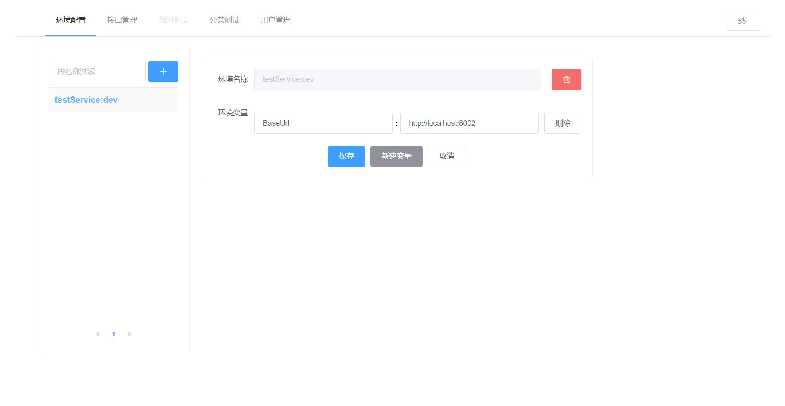
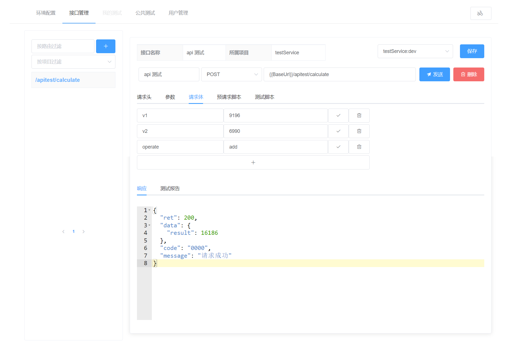
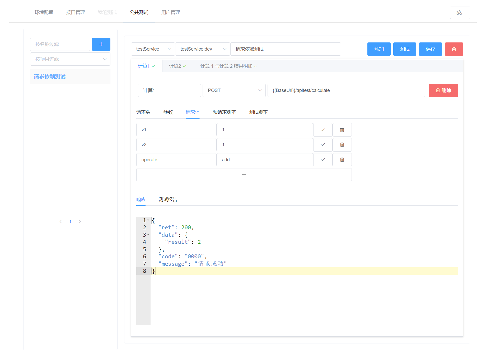
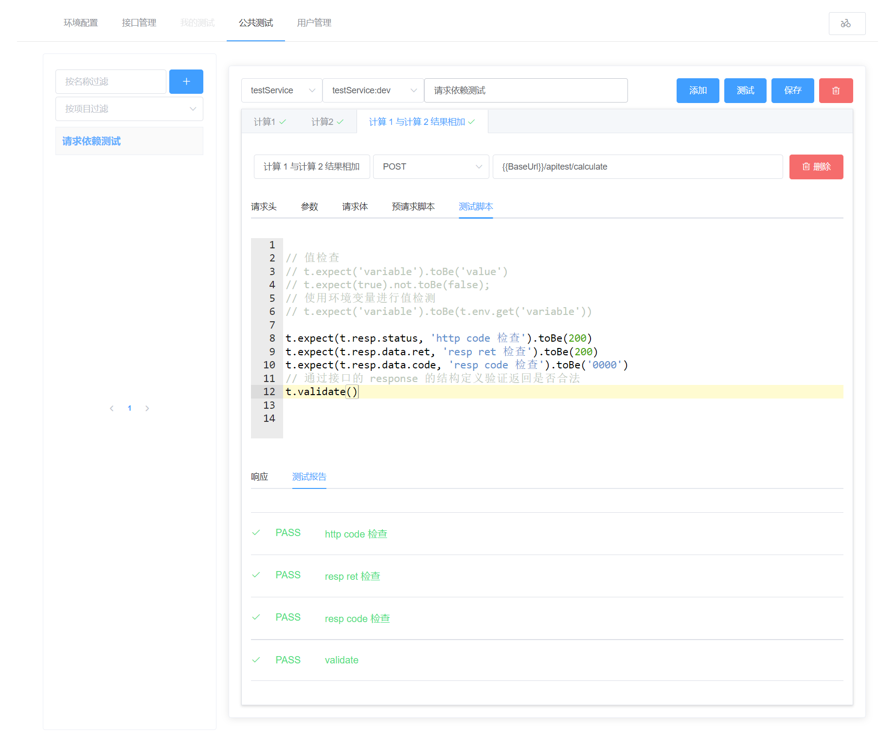

# apitesting

这是一个类似于 postman 的接口测试工具，可以通过 swagger 导入请求

有和 postman 类似的测试脚本支持，支持多个请求前后依赖的测试

### 使用

运行：

- 后端 `go run main.go --config ./config.toml` 或 `./dev.sh`
- 前端 `cd page && npm run serve`

使用 docker 构建：

1. `cd page && npm run build`
2. `./build.sh`

### 为什么不直接使用 postman ?

- postman 团队使用是收费的
- postman 不是开源的，使用这个你可以添加自己的需求

### 使用的组件

Vuejs / Element Plus / SQLite

### 功能截图

设置环境变量

创建 api

创建测试

使用测试脚本

